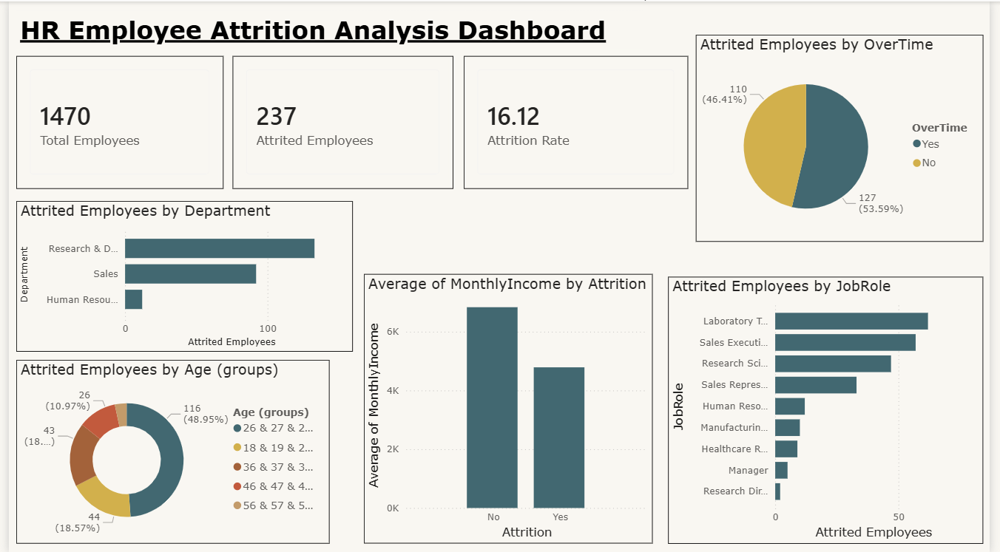

# 📊 HR Employee Attrition Analysis Dashboard

A Power BI dashboard built on the IBM HR Analytics dataset to identify key drivers of employee attrition across departments, age groups, job roles, salary bands, and overtime patterns.

---

## 🔗 Live Dashboard

> Open the `.pbix` file in Power BI Desktop to interact with the full dashboard.

---

## 📌 Project Overview

Employee attrition is one of the most costly challenges for any organization. This project analyzes **1,470 employee records** to uncover why employees leave — and which groups are most at risk.

Built entirely in **Power BI Desktop** using **DAX measures**, custom age groupings, and 6 interactive visuals.

---

## 🖼️ Dashboard Preview



> *Replace this with your actual screenshot — export your dashboard as an image and upload it to the repo*

---

## 💡 Key Insights

| # | Insight | Finding |
|---|---|---|
| 1 | Overall attrition rate | **16.12%** of employees left |
| 2 | Highest attrition department | **Research & Development** (133 employees) |
| 3 | Most at-risk age group | **26–35 years** (48.9% of all attrition) |
| 4 | Highest attrition job role | **Laboratory Technician** |
| 5 | Overtime impact | **53.59%** of employees who left were doing overtime |
| 6 | Salary impact | Employees who left earned avg **₹4.8K vs ₹6.5K** for those who stayed |

---

## 📁 Dataset

- **Source:** [IBM HR Analytics Employee Attrition Dataset](https://www.kaggle.com/datasets/pavansubhasht/ibm-hr-analytics-attrition-dataset)
- **Records:** 1,470 employees
- **Features:** 35 columns including Age, Department, JobRole, MonthlyIncome, OverTime, Attrition, JobSatisfaction, WorkLifeBalance

---

## 🛠️ Tools Used

| Tool | Purpose |
|---|---|
| Power BI Desktop | Dashboard building and visualization |
| DAX | Custom measures and calculations |
| IBM HR Dataset (CSV) | Data source |

---

## 📐 DAX Measures Created

```dax
-- Total number of employees
Total Employees = COUNTROWS('WA_Fn-UseC_-HR-Employee-Attrition')

-- Number of employees who left
Attrited Employees = 
COUNTROWS(
    FILTER('WA_Fn-UseC_-HR-Employee-Attrition', 
    'WA_Fn-UseC_-HR-Employee-Attrition'[Attrition] = "Yes")
)

-- Attrition rate as percentage
Attrition Rate = 
DIVIDE(
    COUNTROWS(FILTER('WA_Fn-UseC_-HR-Employee-Attrition', 'WA_Fn-UseC_-HR-Employee-Attrition'[Attrition] = "Yes")),
    COUNTROWS('WA_Fn-UseC_-HR-Employee-Attrition'),
    0
) * 100
```

---

## 📊 Visuals Built

- **KPI Cards** — Total Employees, Attrited Employees, Attrition Rate
- **Clustered Bar Chart** — Attrition by Department
- **Donut Chart** — Attrition by Age Group
- **Clustered Bar Chart** — Attrition by Job Role
- **Pie Chart** — Attrition by Overtime (Yes vs No)
- **Column Chart** — Average Monthly Income by Attrition

---

## 📂 Repository Structure

```
hr-attrition-powerbi/
│
├── HR_Attrition_Dashboard.pbix       # Power BI dashboard file
├── WA_Fn-UseC_-HR-Employee-Attrition.csv  # Dataset
├── dashboard_screenshot.png          # Dashboard preview image
└── README.md                         # Project documentation
```

---

## 🚀 How to Open

1. Download and install [Power BI Desktop](https://powerbi.microsoft.com/desktop/) (free)
2. Clone this repository
3. Open `HR_Attrition_Dashboard.pbix` in Power BI Desktop
4. Explore the interactive dashboard

---

## 🎯 Business Recommendations

Based on the analysis:

1. **Address overtime policies** — Over 53% of attrition is linked to overtime. Enforce work-life balance policies.
2. **Review salary bands** — Employees earning below average are significantly more likely to leave. Conduct a compensation audit.
3. **Focus on 26–35 age group** — Nearly 50% of attrition comes from this group. Introduce growth and mentorship programs.
4. **Retain Lab Technicians** — Highest attrition role. Consider targeted retention bonuses or career path clarity.

---

## 👩‍💻 Author

**Sayali Kale**
B.Tech Computer Engineering | AISSMS College of Engineering, Pune
Targeting AI/ML and Data Analytics roles — Placement 2026

[](https://github.com/sayali51)
[](https://linkedin.com/in/YOUR-LINKEDIN-HERE)
